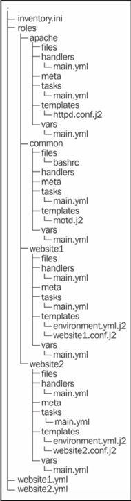

# Chapter 4. 대규모 프로젝트

- 플레이북을 여러개의 파일로 분리하고, 다른 위치에서 분리된 파일을 포함하기
- 같은 기능을 수행하는 여러 개의 파일을 포함하는 역할을 사용하기
- 앤시블이 설정한 장비에서 속도를 높이기 위한 방법

## Include

복잡한 서버 인프라 환경에서는 플레이북이 커질수 있고, 이것은 플레이북을 읽고 유지보수하는데 어려워 질수 있다.

이에 대한 해결책으로 Include라는 방법을 제공 함.

Include를 사용하여 플레이블 여러 부분으로 분할하고, 분할된 각 부분들을 다른 플레이에서 재사용할 수 있다.


### Include의 종류

- Variable Include : 외부 Yaml 파일의 변수를 저장

- Task Include : 다른 파일에 공통 Task를 저장하고 필요할 때마다 공통 Task를 포함할 때 사용

- Handler Include : 한 장소에 Handler를 모두 저장할 수 있도록 저장

- PlayBook Include : 하나의 플레이에서 다른 파일의 플레이를 포함할 때 사용

  ### Variable Include

  변수가 포함된 yml파일을 Include 할수 있슴. (Chapter 2에서 설명)

  <u>country-AU.yml</u>

  ```
  ---
  ntp: 'ntp1.au.example.com'
  TZ: 'Australia/Sydney'
  ```

  ```
  vars_files:
    /conf/country-AU.yml
    /conf/datacenter-SYD.yml
    /conf/cluster-mysql.yml
  ```

  ### Task Include

  반복될 많은 공통 Task를 가지고 있을 때, Task Include를 사용 가능

  Task Include가 포함된 플레이의 팩트를 상속

  <u>usersetup.yml</u> : 하나의 사용자를 생성하는 Task

  ```
  ---
  # Requires a user variable to specify user to setup	#1
  - name: Create user account							#2
    user: name={{user}} state=present					#3

  - name: Make user SSH config dir					#4
    file: path=/home/{{user}}/.ssh owner={{user}} group={{user}} mode=0600 state=directory									 #5

  - name: Copy in public key							#6
    copy: src=keys/{{user}}.pub dest=/home/{{user}}/.ssh/authorized_keys mode=0600 owner{{user}} group={{user}}						 #7
  ```

  <u>multiple-usersetup.yml</u> : user 변수를 넘겨주어 다수의 사용자를 생성

  ```
  ---
  - hosts: ansibletest
    user: root
    tasks:
      - include: usersetup.yml use{{item}}
        with_items:
          - mal
          - dan
          - kate
  ```

  ### Handler Include

  PlayBook 작성시 동일한 Handler를 여러번 참조하여 재사용해야 할 경우 사용

  <u>sendmailhandlers.yml</u> : sendmail 설정 후 처리하기를 원하는 공통 Task를 Handler 파일로 제공

  ```
  ---
  - name: config sendmail
    command: make -C /etc/mail
    notify : reload sendmail

  - name: config aliases
    command: newalliases
    notify: reload sendmail

  - name: reload sendmail
    service: name=sendmail state=reloaded

  - name: restart sendmail
    service: name=sendmail state=restarted
  ```

  - config sendmail Handler : sendmail 데이터베이스의 config 파일을 재생성한 후 sendmail 파일을 reload
  - config aliases Handler : aliases 데이터베이스를 초기화한 후 sendmail reload
  - reload sendmail Handler : sendmail reload
  - restart sendmail Handler : sendmail restart

  <u>update_config_sendmail.yml</u> : sendmail 최신버전으로 업데이트 및 config 파일을 Template으로 교체

  ```
  ---
    hosts: mailers															#1
    tasks:																	#2
      - name: update sendmail													#3
        yum: name=sendmail state=latest										#4
        notify: restart sendmail												#5
      
      - name: configure sendmail												#6
        template: src=templates/sendmail.mc.j2 dest=/etc/mail/sendmail.mc		#7
        notify: config sendmail												#8
        
    handlers:																	#9
      - include: sendmailhandlers.yml											#10
  ```

  ### PlayBook Include

  Task의 전체 내용을 포함하기 위해서 PlayBook Include를 사용할수 있음.

  PlayBook Include는 완전히 독립적인 파일을 포함

  한번에 여러 개의 액션을 실행하기 월할 때 유용

  <u>site_upgrade.yml</u> : 사이트 전체를 업그레이드 하는 PlayBook

  ```
  ---
  - include "drfailover.yml"									#1
  - include "upgradeapp.yml"									#2
  - include "drfailback.yml"									#3

  - name: Notify management									#4
    hosts: local												#5
    tasks:													#6
      - local_action: mail to="mgmt-team@example.com" msg='The application has been upgraded and is now live'									  #7

  - include "drupgrade.yml"									#8
  ```

  - drfailover.yml : DR 사이트에 Switch Over하는 PlayBook
  - upgradeapp.yml : Application을 업그레이드하는 PlayBook
  - drfailback.yml : 장애를 복구하는 PlayBook
  - drupgrade.yml : ??

  Include 된 각각의 PlayBook이 개별적으로 동작할 수 있으나, 모든 PlayBook을 한번에 수행하기를 원할때 유용함.

### Role

자동으로 몇가지 문제를 해결하는 Include의 확장 개념

PlayBook 저장소내에 PlayBook을 체게화 할수 있슴.

Role 폴더내에 Variable, Task, Template, Handler를 위치할 수 있으며, 이를 Include할수 있도록 도와준다.

Role은 또 다른 Role을 포함하는 것도 가능함.

어떤 하나의 작업 단위를 Role과 비유할수 있을 것 같음.

예를들면,

- Nginx 또는 Apache와 같은 웹 서버 설정
- 장비의 보안 수준에 맞춘 사용자 정의 날짜 메시지들 설정
- PostgresSQL 또는 MySQL이 실 행중인 데이터베이스 서버 설정

Ansible에서 Role을 관리하기 위한 단계 :

1. PlayBook으로 "roles"라는 이름의 폴더를 생성

2. roles 폴더에서 원하는 각 Role의 폴더를 생성(ex> nginx, apache, postgresql, mysql, etc,.)

3. 각 role 폴더에 files, handlers, meta, tasks, templates, vars라는 폴더를 생성(Ansible은 해당되는 파일 또는 디렉토리가 없으면 이를 무시함)

4. PlayBook에서 장비에 적용하고자하는 Role목록 다음에 roles 키워드를 추가한다.

5. common, apache, website1, website2 Role을 사용하고자 한다면 다음 예제와 같은 디렉토리 구조로 생성

    

   <u>website1.yml</u> : common, apache, website1 Role을 website1 그룹 장비에 적용하는 PlayBook

   ```
   ---
   - name: Setup servers for website1.example.com
     hosts: website1
     roles:
       - common
       - apache
       - {role: website1, port: 80}
   ```

   common Role :  

   - Task Include(roles/common/tasks/main.yml)
   - Handler Include(roles/common/handlers/main.yml)
   - Variable Include(roles/common/vars/main.yml)
   - 만일 해당되는 모든 파일을 찾지 못하는 경우에는 Ansible을 에러를 발생시킴
   - 해당 파일중 하나라도 존재하고 나머지 다른 파일을 찾지 못한다면 다른 파일은 무시됨

   ​

   Ansible 에서 사용되는 Directory :

   | 디렉토리      | 설명                                       |
   | --------- | ---------------------------------------- |
   | tasks     | Task 목록을 포함하는 main.yml 파일을 반드시 포함해야 함. Task Role에 포함된 모든 Task Include는 해당 파일들이 위치해 있어야 함. |
   | files     | script 모듈이나 copy 모듈에 의해 사용되는 Role의 파일을 위한 기본 위치 |
   | templates | template 모듈이 자동으로 Jinja2 템플릿을 찾는 디렉토리    |
   | handlers  | Role의 Handler를 기술한 main.yml 파일을 반드시 포함해야 함. |
   | vars      | Role의 변수를 포함하는 main.yml을 포함해야 함.         |
   | meta      | Role을 위한 설정과 의존 목록을 포함한 main.yml파일을 포함해야 함. Ansible 1.3 이상에서만 사용 가능 |
   | default   | Role 호출하는 PlayBook에서 넘겨지는 변수에 오버라이드 될수 있는 변수의 초기값을 얻기 위해 해당 폴더의 main.yml 파일이 로드됨. Ansible 1.3 이상에서만 사용 가능 |

   Role을 사용할 때 copy, template, script 모듈의 작동 방식이 약간 변경 됨.

   PlayBook 파일이 위치한 디렉토리 대신 Role의 위치에서 PlayBook 파일을 찾게 됨.

   예를들어, common이라는 이름의 Role을 사용하고 있다면 :

   - copy 모듈은 roles/common/files 에서 파일을 검색

   - template 모듈은 roles/common/templates 에서 템플릿 파일을 검색

   - 다른 모듈은 roles/common 안에 다른 폴더의 데이터를 기대할 것을 결정 할 수 있다(???) => ansible-doc의 각 모듈 설명을 참조

     ### 1.3의 새로운 기능

- metadata Role : 다른 Role과의 의존성을 가지게 할 수 있다.

  예를들어, 배포중인 애플리케이션이 메일을 전송할 필요가 있을때, 메일을 전송하기 위한 Postfix가 설치 되어있지 않다면, 의존성을 명시하여 Postfix의 설치 및 설정을 하도록 동작 시키는 것이 가능하다.

  <u>meta/main.yml</u>

  ```
  ---
  allow_duplicates: no
  dependencies:
  - apache
  ```


- 변수의 기본 값 : Role에 변수를 넘기는 것을 선택적으로 가능

  변수가 Role로 넘겨질때 오버라이드 할 수 있슴.

  예를들면, Role에서 port라는 이름의 변수를 사용하고 기본 값을 80으로 지정할 수 있다.

<u>/default/main.yml</u>

```
---
port: 80
```

### 속도 내기

많은 장비와 서비스가 추가 된다면, Ansible 설정시에 속도가 느려지거나 오랜 시간이 걸릴수 있다.

대규모 Ansible 작업을 위한 Tip!

#### Tag

PlayBook의 어느 부분을 실행할지 또는 생략할지 선택할 수 있도록 하는 기능

실행될 특정 액션이 필요하지 않다면, 특정 Tag를 명시하여 원하는 모듈만 선택 동작 할수 있다.

예를들어, SSH키가 위험에 노출되어 해당 키들만 새로이 복사할 필요가 있을때 PlayBook을 재작성 하지 않고, Tag를 활용하여 SSH 키 복사 부분만 수행하는 것도 가능

<u>webservers.yml</u> : patch, deploy, config Tag를 정의

```
- name: Install and setup our webservers
  hosts: webservers
  tasks:

- name: install latest software
    action: yum name=$item state=latest
    notify: restart apache
    tags:
  - patch
    with_items:
- httpd
  - webalizer
- name: Create subdirectories
    action: file dest=/var/www/html/$item state=directory mode=755 owner=apache group= apache
    tags:
  - deploy
    with_items:
- pub
- name: Copy in web files
    action: copy src=website/$item dest=/var/www/html/$item mode=0755 owner=apache group=apache
    tags:
  - deploy
    with_items:
- index.html
  - logo.png
  - style.css
  - app.js
  - pub/index.html
- name: Copy webserver config
    tags:
  - deploy
  - config
    action: copy src=website/httpd.conf dest=/etc/httpd/conf/httpd.conf mode=0644 owner=root group=root
    notify: reload apache
- name: set apache to start on startup
    action: service name=httpd state=started enabled=yes

handlers:

- name: reload apache
  service: name=httpd state=reloaded
- name: restart apache
  service: name=httpd state=restarted

```

실행을 원하는 Tag를 지정하지 않으면 모든 작업이 수행됨.

```
$ ansible-playbook webservers.yml --tags deploy
```

Role에서도 Tag를 사용 가능

```
- hosts: website1
  roles:

- common
- { role: apache, tags: ["patch"]}
- { role: website2, tags: ["deploy", "patch"]}
```

#### Ansible의 Pull 방식

Target 장비에서 직접 수행되며, 이것은 ansible-pull 명령으로 수행 되며, git 저장소에서 설정을 제공한다.

Ansible Pull 방식을 사용하는 경우:

- 자동으로 확장되는 서버 팜의 서버를 미리 설정 할 경우
- forks에 큰 값이(기본: 5) 설정되어있고, 설정 대상 장비가 많은 경우 모든 장비를 설정하는데 오랜 시간이 소요가 예상 되는 경우
- 저장소 변경될 때, 자동으로 장비 설정이 업데이트되기를 기대할 경우
- 네트워크 접속을 하지 않은 장비에 Ansible이 실행되기를 원할 경우

Ansible Pull 방식이 맞지 않는 경우:

- 다른 장비에 연결해서 변수를 수집 하거나 관리 장비의 자격 증명을 필요로 하는 파일을 복사할 경우
- 모든 서버 팜에 걸쳐 한번에 진행되는 PlayBook의 실행수를 제한 해야 할 경우
- Ansible로 장비를 설정하기 위해 장비로의 SSH 연결을 허용하지 않는 F/W 뒤에 서버들이 존재 할때

Ansible은 Pull/Push 방식을 상황에 따라 적절하게 사용될 수 있다.

<u>ansible_pull_mode.yml</u>

```
  ---
   - name: Ansible Pull Mode
     hosts: pullhosts
     tasks:
       - name: Setup EPEL
         command: "rpm -ivh
           http://download.fedoraproject.org/pub/epel/6/i386/epel-
   release-6-8.noarch.rpm"
         args:
            creates=/etc/yum.repos.d/epel.repo
       - name: Install Ansible + Dependencies
         yum:
           name: "{{ item }}"
           state: latest
           enablerepo: epel
         with_items:
         - ansible
         - git-core
       - name: Make directory to put downloaded playbooks in
         file:
           state: directory
           path: /opt/ansiblepull
       - name: Setup cron
         cron:
           name: "ansible-pull"
           user: root
           minute: "*/5"
           state: present
           job: "ansible-pull -U
   https://git.int.example.com.com/gitrepos/ansiblepull.git
    -D /opt/ansiblepull {{ inventory_hostname_short }}.yml"
```

1. EPEL 설치
2. Ansible 설치
3. PlayBook 저장 디렉토리 생성
4. 매 5분마다 ansible-pull 방식의 실행 Cron Job 등록
