# Chapter 5. 사용자 정의 모듈

## 작성자
- Bash: Ian Y. Choi
- Python: (TO-DO)

## 개요

- 살펴볼 내용
  - 배시 스크립트 또는 파이썬으로 모듈을 작성하는 방법
  - 개발한 사용자 정의 모듈을 사용하기
  - 인벤토리로서 외부 데이터 소스를 사용하는 스크립트 작성하기

- 스크립트 대신 모듈을 사용하는 상황
  - 매번 스크립트를 실행하기 원하지 않을 때
  - 출력을 처리할 필요가 있을 때
  - 자바스크립트를 팩트로 만들 필요가 있을 때
  - 복잡한 변수를 인수로 보낼 필요가 있을 때

- ansible 소스 다운로드 필요
  - $ git clone https://github.com/ansible/ansible.git
  - $ cd ansible
  - $ git checkout v1.3.0
  - $ chmod +x hacking/test-module

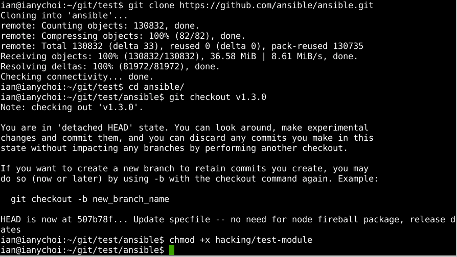

## 배시로 모듈 작성

- 1. 스크립트 작성

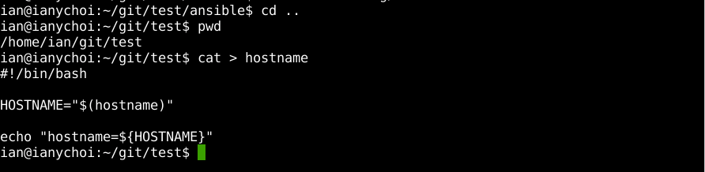

- 2. 실행시 오류 발생

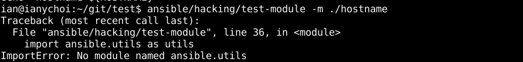

- 3. 해결책: ansible 실행을 위한 환경 변수 source

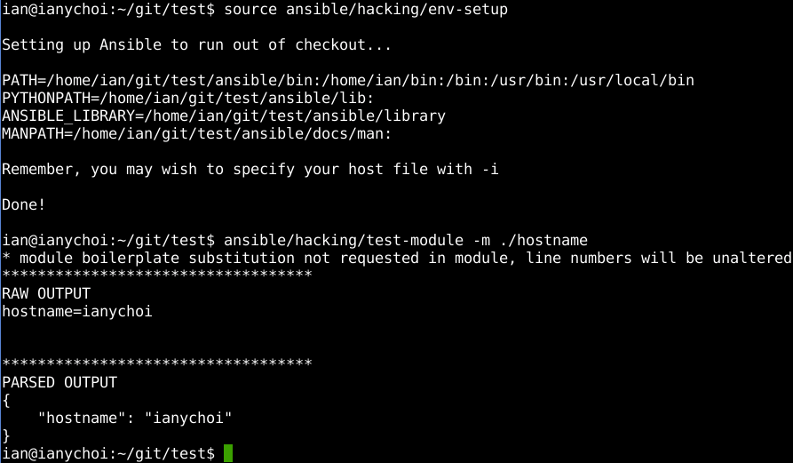

- 4. 두 번째: 개선된 스크립트

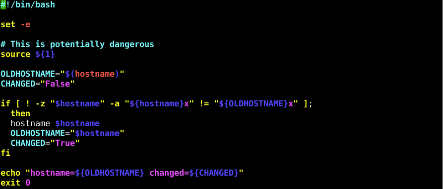

- 5. sudo를 활용한 실행 필요

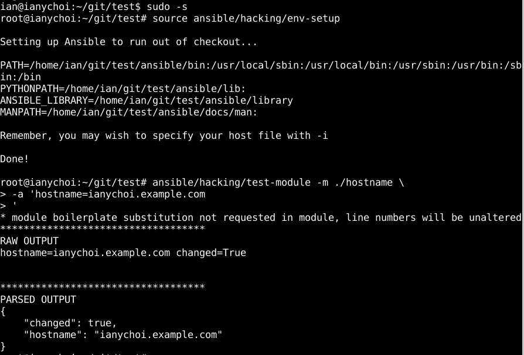

- 6. 두 번째 실행하였을 때는 changed가 False가 됨

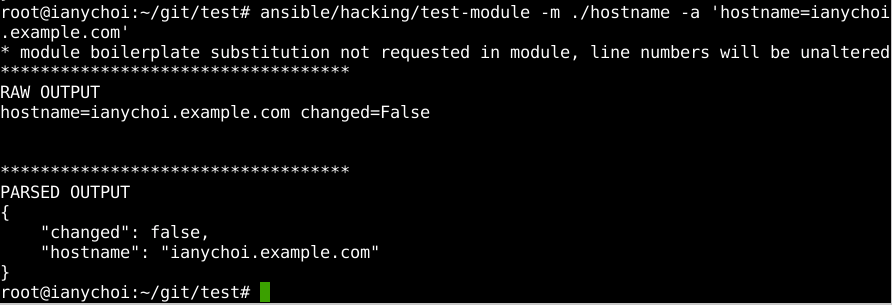

- 7. Playbook 모듈로 실행시 fail

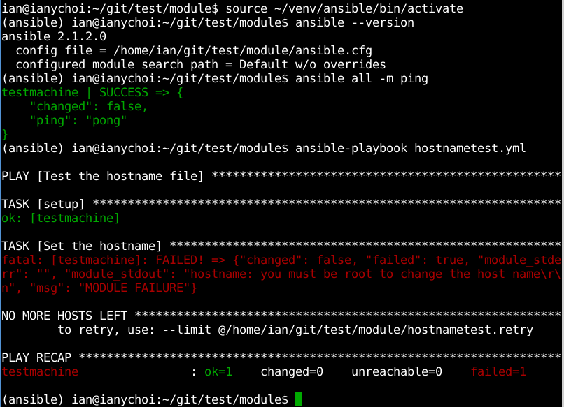

- 8. 그러나 호스트 이름이 변경된 것으로 확인됨

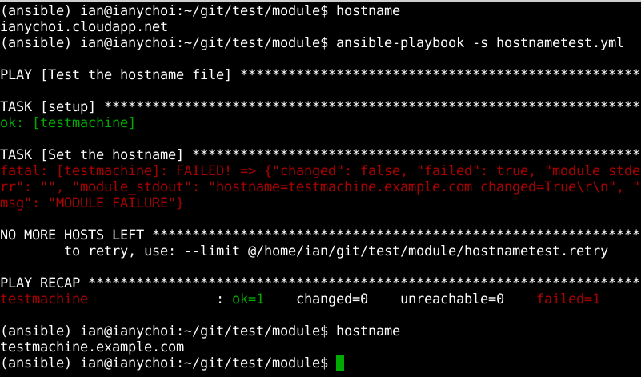

- 9. 세 번째: JSON을 echo하도록 개선한 스크립트

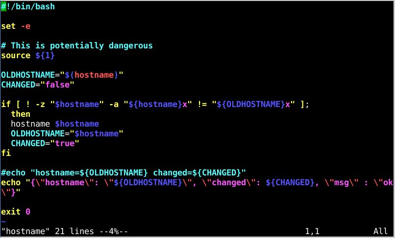

- 10. 실행 완료

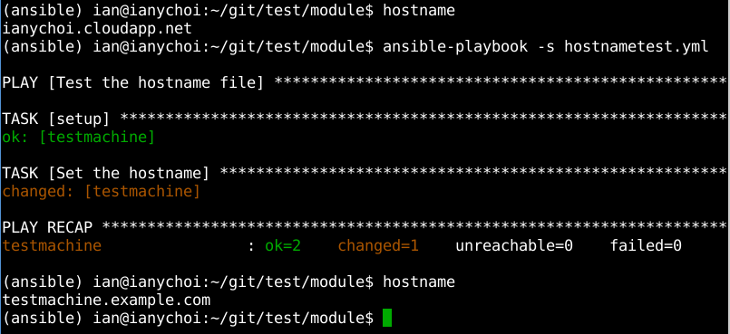

